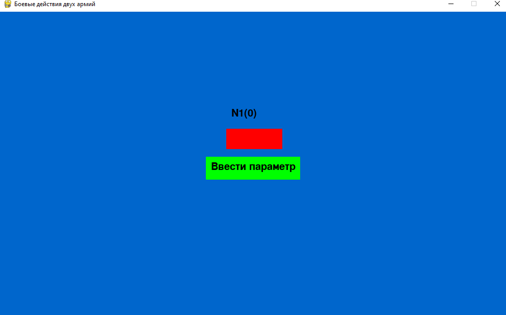

# Combat Operations of Two Armies

Student project on mathematical modeling. Implemented a model of combat operations of two armies. The model takes into account combat units such as: regular army and partisan formations.

## Demo

